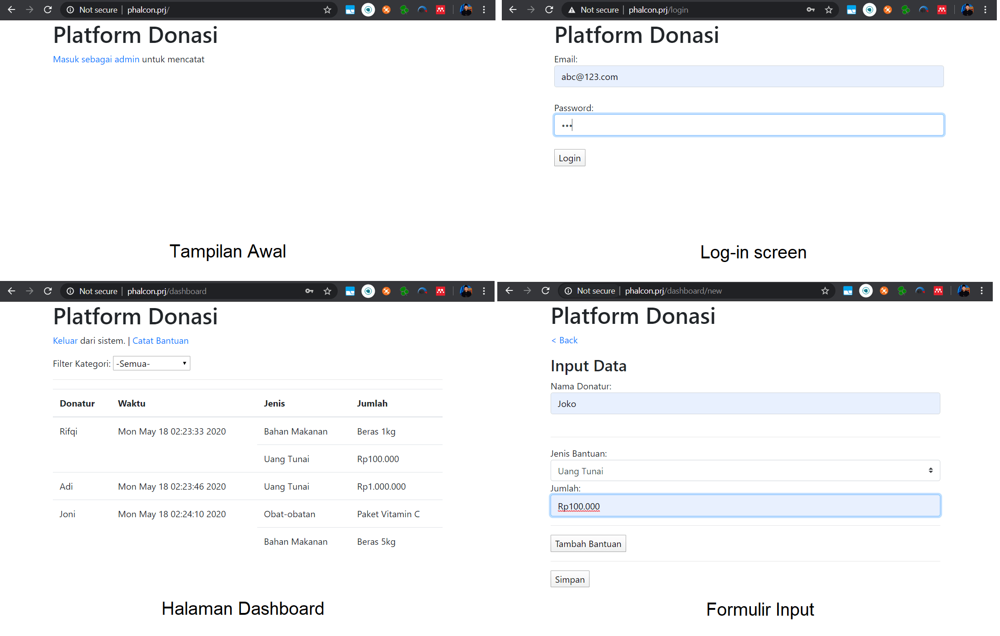

# EAS PBKK
Mohammad Ardika Rifqi - 05111740000119

[File PDF](Penjelasan%20EAS.pdf)  

## Penjelasan Aplikasi
Aplikasi ini adalah sistem sederhana bagi administrator untuk mencatat daftar donatur untuk melakukan rekap data.

1. Tuliskan dan jelaskan data apa saja yang harus disimpan dan di tabel apa saja data tersebut disimpan.
   
   Tabel yang harus dipersiapkan adalah:  
   1. **user**: Tabel ini menyimpan data login user berupa email, dan password (plain-text)
   2. **bantuan**: Tabel ini menyimpan kapan bantuan disimpan, dan mempunyai relasi ke bantuan_data.
   3. **bantuan_data**: Tabel ini menyimpan data bantuan berupa Jenis bantuan, dan Jumlahnya.

2. Tuliskan dan jelaskan view-view apa saja yang harus disiapkan untuk membuat sistem di atas.

    View yang harus dipersiapkan adalah: Template basis **(index.phtml)**, Halaman Login **(login/index)**,dan dashboard yang berisikan tabel rekap **(dashboard/index)**, dan formulir untuk menambahkan data **(dashboard/new)**.

3. Tuliskan dan jelaskan controller (beserta fungsi-fungsinya) apa saja untuk membuat sistem di atas.
   
    Di sistem ini terdapat 3 controller. `IndexController` berfungsi sebagai halaman welcome, `LoginController` berfungsi untuk menghandle session dan proses log-in, `DashboardController` berfungsi untuk menghandle proses input dan penampilan rekapitulasi data.

4. Tuliskan dan jelaskan nama-nama kelas model yang harus disiapkan

    Model yang harus disiapkan adalah `Bantuan`, `BantuanData`, dan `Users` sesuai hirarki relasi tabel. Masing-masing file memanggil `$this->setSource()` secara eksplisit untuk memberitahu Phalcon tabel yang akan digunakan.

## Screenshot

